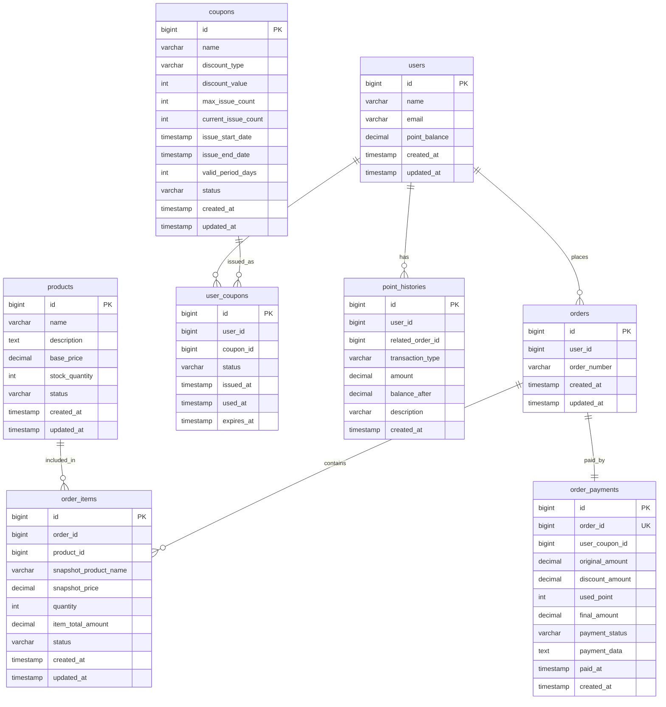

# Entity Relationship Diagram (ERD)

## 📊 ERD 다이어그램



---

## 📋 테이블 목록

| 번호 | 테이블명 | 설명 |
|------|---------|------|
| 1 | users | 사용자 정보 |
| 2 | products | 상품 정보 |
| 3 | orders | 주문 정보 |
| 4 | order_items | 주문 상품 상세 |
| 5 | order_payments | 결제 정보 |
| 6 | coupons | 쿠폰 정책 |
| 7 | user_coupons | 사용자 보유 쿠폰 |
| 8 | point_histories | 포인트 이력 |

---

## 🗄️ 테이블 생성 쿼리

### 1. users (사용자)

```sql
CREATE TABLE users (
    id BIGINT PRIMARY KEY AUTO_INCREMENT,
    name VARCHAR(100) NOT NULL COMMENT '사용자 이름',
    email VARCHAR(255) NOT NULL UNIQUE COMMENT '이메일',
    point_balance DECIMAL(15,2) NOT NULL DEFAULT 0 COMMENT '포인트 잔액',
    created_at TIMESTAMP NOT NULL DEFAULT CURRENT_TIMESTAMP,
    updated_at TIMESTAMP NOT NULL DEFAULT CURRENT_TIMESTAMP ON UPDATE CURRENT_TIMESTAMP,
    
    INDEX idx_email (email)
) COMMENT '사용자';
```

---

### 2. products (상품)

```sql
CREATE TABLE products (
    id BIGINT PRIMARY KEY AUTO_INCREMENT,
    name VARCHAR(200) NOT NULL COMMENT '상품명',
    description TEXT COMMENT '상품 설명',
    base_price DECIMAL(10,2) NOT NULL COMMENT '기본 가격',
    stock_quantity INT NOT NULL DEFAULT 0 COMMENT '재고 수량',
    status VARCHAR(20) NOT NULL DEFAULT 'ACTIVE' COMMENT '상태: ACTIVE, INACTIVE, DISCONTINUED',
    created_at TIMESTAMP NOT NULL DEFAULT CURRENT_TIMESTAMP,
    updated_at TIMESTAMP NOT NULL DEFAULT CURRENT_TIMESTAMP ON UPDATE CURRENT_TIMESTAMP,
    
    INDEX idx_status (status),
    INDEX idx_stock (stock_quantity)
) COMMENT '상품';
```

---

### 3. orders (주문)

```sql
CREATE TABLE orders (
    id BIGINT PRIMARY KEY AUTO_INCREMENT,
    user_id BIGINT NOT NULL COMMENT '사용자 ID',
    order_number VARCHAR(50) NOT NULL UNIQUE COMMENT '주문 번호',
    created_at TIMESTAMP NOT NULL DEFAULT CURRENT_TIMESTAMP,
    updated_at TIMESTAMP NOT NULL DEFAULT CURRENT_TIMESTAMP ON UPDATE CURRENT_TIMESTAMP,
    
    INDEX idx_user_created (user_id, created_at),
    INDEX idx_order_number (order_number)
) COMMENT '주문';
```

---

### 4. order_items (주문 상품)

```sql
CREATE TABLE order_items (
    id BIGINT PRIMARY KEY AUTO_INCREMENT,
    order_id BIGINT NOT NULL COMMENT '주문 ID',
    product_id BIGINT NOT NULL COMMENT '상품 ID',
    snapshot_product_name VARCHAR(200) NOT NULL COMMENT '주문 당시 상품명',
    snapshot_price DECIMAL(10,2) NOT NULL COMMENT '주문 당시 가격',
    quantity INT NOT NULL COMMENT '주문 수량',
    item_total_amount DECIMAL(15,2) NOT NULL COMMENT '상품 총액 (단가 × 수량)',
    status VARCHAR(20) NOT NULL DEFAULT 'PENDING' COMMENT '상태: PENDING, CONFIRMED, CANCELLED, REFUNDED',
    created_at TIMESTAMP NOT NULL DEFAULT CURRENT_TIMESTAMP,
    updated_at TIMESTAMP NOT NULL DEFAULT CURRENT_TIMESTAMP ON UPDATE CURRENT_TIMESTAMP,
    
    INDEX idx_order (order_id),
    INDEX idx_product (product_id),
    INDEX idx_status (status),
    INDEX idx_created (created_at)
) COMMENT '주문 상품';
```

---

### 5. order_payments (결제)

```sql
CREATE TABLE order_payments (
    id BIGINT PRIMARY KEY AUTO_INCREMENT,
    order_id BIGINT NOT NULL UNIQUE COMMENT '주문 ID',
    user_coupon_id BIGINT COMMENT '사용한 쿠폰 ID',
    original_amount DECIMAL(15,2) NOT NULL COMMENT '원 금액',
    discount_amount DECIMAL(15,2) NOT NULL DEFAULT 0 COMMENT '쿠폰 할인 금액',
    used_point INT NOT NULL DEFAULT 0 COMMENT '사용 포인트',
    final_amount DECIMAL(15,2) NOT NULL COMMENT '최종 결제 금액',
    payment_status VARCHAR(20) NOT NULL DEFAULT 'PENDING' COMMENT '결제 상태: PENDING, COMPLETED, FAILED, REFUNDED',
    payment_data TEXT COMMENT '결제 관련 추가 데이터 (JSON)',
    paid_at TIMESTAMP COMMENT '결제 완료 시간',
    created_at TIMESTAMP NOT NULL DEFAULT CURRENT_TIMESTAMP,
    
    INDEX idx_order (order_id),
    INDEX idx_status (payment_status),
    INDEX idx_paid_at (paid_at)
) COMMENT '주문 결제';
```

---

### 6. coupons (쿠폰 정책)

```sql
CREATE TABLE coupons (
    id BIGINT PRIMARY KEY AUTO_INCREMENT,
    name VARCHAR(100) NOT NULL COMMENT '쿠폰명',
    discount_type VARCHAR(20) NOT NULL COMMENT '할인 타입: PERCENTAGE, FIXED_AMOUNT',
    discount_value INT NOT NULL COMMENT '할인 값 (% 또는 금액)',
    max_issue_count INT NOT NULL COMMENT '최대 발급 수량',
    current_issue_count INT NOT NULL DEFAULT 0 COMMENT '현재 발급된 수량',
    issue_start_date TIMESTAMP NOT NULL COMMENT '발급 시작일',
    issue_end_date TIMESTAMP NOT NULL COMMENT '발급 종료일',
    valid_period_days INT NOT NULL COMMENT '유효 기간 (일)',
    status VARCHAR(20) NOT NULL DEFAULT 'ACTIVE' COMMENT '상태: ACTIVE, INACTIVE',
    created_at TIMESTAMP NOT NULL DEFAULT CURRENT_TIMESTAMP,
    updated_at TIMESTAMP NOT NULL DEFAULT CURRENT_TIMESTAMP ON UPDATE CURRENT_TIMESTAMP,
    
    INDEX idx_issue_period (issue_start_date, issue_end_date),
    INDEX idx_status (status),
    INDEX idx_issue_count (current_issue_count)
) COMMENT '쿠폰 정책';
```

---

### 7. user_coupons (사용자 쿠폰)

```sql
CREATE TABLE user_coupons (
    id BIGINT PRIMARY KEY AUTO_INCREMENT,
    user_id BIGINT NOT NULL COMMENT '사용자 ID',
    coupon_id BIGINT NOT NULL COMMENT '쿠폰 ID',
    status VARCHAR(20) NOT NULL DEFAULT 'AVAILABLE' COMMENT '상태: AVAILABLE, USED, EXPIRED',
    issued_at TIMESTAMP NOT NULL DEFAULT CURRENT_TIMESTAMP COMMENT '발급 시간',
    used_at TIMESTAMP COMMENT '사용 시간',
    expires_at TIMESTAMP NOT NULL COMMENT '만료 시간',
    
    INDEX idx_user_status (user_id, status),
    INDEX idx_coupon (coupon_id),
    INDEX idx_expires (expires_at)
) COMMENT '사용자 쿠폰';
```

---

### 8. point_histories (포인트 이력)

```sql
CREATE TABLE point_histories (
    id BIGINT PRIMARY KEY AUTO_INCREMENT,
    user_id BIGINT NOT NULL COMMENT '사용자 ID',
    related_order_id BIGINT COMMENT '관련 주문 ID (없을 수 있음)',
    transaction_type VARCHAR(20) NOT NULL COMMENT '거래 타입: CHARGE, USE, REFUND',
    amount DECIMAL(15,2) NOT NULL COMMENT '변동 금액 (양수: 증가, 음수: 감소)',
    balance_after DECIMAL(15,2) NOT NULL COMMENT '변동 후 잔액',
    description VARCHAR(500) COMMENT '설명',
    created_at TIMESTAMP NOT NULL DEFAULT CURRENT_TIMESTAMP,
    
    INDEX idx_user_created (user_id, created_at),
    INDEX idx_order (related_order_id),
    INDEX idx_type (transaction_type)
) COMMENT '포인트 이력';
```

---

## 🎯 설계 주요 결정사항

### 1. 테이블 분리 전략


### 2. 스냅샷 저장


### 3. 상태 관리


### 4. 동시성 제어 포인트


### 5. 확장성 고려


---

## 🔐 제약사항 및 비즈니스 규칙

### 데이터 제약사항


### 비즈니스 규칙


---

## 📈 인덱스 설계 전략

### 조회 성능 최적화 대상


### 복합 인덱스 설계


---

## 🚀 확장 시나리오

### 1. 상품 옵션 추가 시


### 2. 배송 기능 추가 시


### 3. 리뷰 기능 추가 시


---

## 📊 테이블 관계 요약

| 관계 | 설명 | Cardinality |
|------|------|-------------|
| users - orders | 사용자는 여러 주문을 할 수 있다 | 1:N |
| users - user_coupons | 사용자는 여러 쿠폰을 보유할 수 있다 | 1:N |
| users - point_histories | 사용자는 여러 포인트 이력을 가진다 | 1:N |
| products - order_items | 상품은 여러 주문에 포함될 수 있다 | 1:N |
| orders - order_items | 주문은 여러 상품을 포함한다 | 1:N |
| orders - order_payments | 주문은 하나의 결제를 가진다 | 1:1 |
| coupons - user_coupons | 쿠폰은 여러 사용자에게 발급된다 | 1:N |
